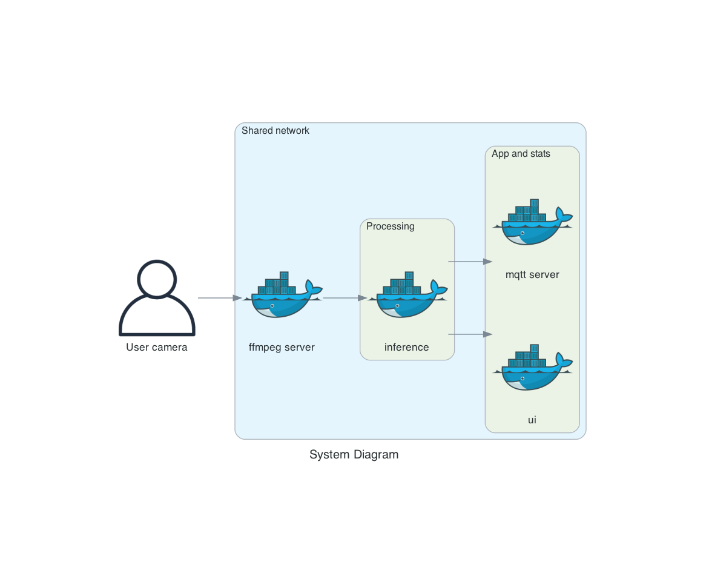

# Deploy a People Counter App at the Edge

| Details               |                   |
| --------------------- | ----------------- |
| Programming Language: | Python 3.5 or 3.6 |

## Description

A People Counter application that use inference to detect a person within a frame and visualises statistics from the inference.

More details on the program can be found inside [PROJECT_README.md](./PROJECT_README.md)

The main task here was the complex multi container setup, rather than the app itself.

## Docker diagram

## Reasoning

Having never used Docker before I noticed a clear need for it here since my ultimate goal was to port this app to an embedded system.

The changes to the app where minimal and 80% of work went into the Dockerisation of the system.

I decided early to use multiple containers to separate concerns, but this caused forced me to learn more about distributed systems architecture and how to properly organise the containers in a way that wouldn't break system dependencies.

## Challenges and problems

### ffmpeg server

FFmpeg server was required for this project, but it is a deprecated feature. Luckily I managed to take advantage of Docker image versioning in order to pull the correct version of the package.

How did I do it? Well I correlated the container image version with the ffmpeg package version that I needed. Low and belod the image's apk registers point to those versions too, so I simply installed the package from the apk registry and got exactly the right version of ffmpeg I needed.

Is this the best way? No, but it beats the hell out of trying to create a gcc image, downloading an old binary and building that binary in the container. I actually pursued this route and ended up with a really long start time for the container which was fine in isolation, but impossible to deal with in the context of the orchestration.

### Order and dependencies

> Who came first? The ffmpeg container, or the MQTT server? 

It took a few tries and some serious thinking to properly settle on the right orchestration order.

Also the container depend on each other so I made use of some bash scripts and health checks in order to make sure that dependency containers are up before starting a dependent container.

### Network

A share network was crucial because the containers needed to talk to each other. This was my first attempt at shared networks within Docker and it took a fair bit of research before settling on the existing solution.

Accurate port mapping, port exposing, and learning about how to listen to ports within a shared network were the highlight.

### Clean up 

I still need to automate the Docker resource cleanup, but this project has been an eye ope